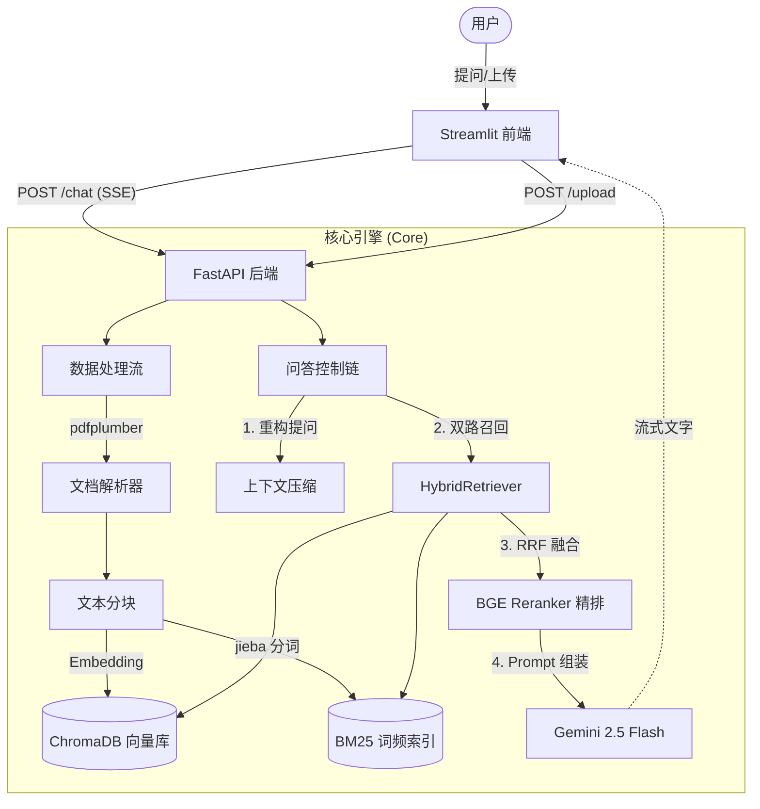

# DocMind — 企业文档智能问答平台 🧠

DocMind 是一个基于 RAG (Retrieval-Augmented Generation) 技术构建的企业级知识库问答系统。它能够对企业内部的 PDF、Word、Markdown 等文档进行智能解析、语义检索，并利用大语言模型（LLM）生成精准、专业的回答。

## 🌟 核心特性与简历亮点

*   **前后端分离架构**：基于 FastAPI 构建高性能异步后端，Streamlit 打造轻量级交互界面，REST API 与 SSE 流式响应分离。
*   **混合检索 (Hybrid Search) + RRF 融合**：摒弃单一的向量检索，采用 **Chroma (稠密向量)** + **BM25 (稀疏词频)** 双路召回机制，通过 RRF 公式消除偏差，有效解决长尾专有名词漏召回痛点。
*   **BGE Reranker 二次精排**：引入智源 `BAAI/bge-reranker-v2-m3` 交叉编码器模型，对候选文档进行细粒度交叉注意力打分，使问答准确率从 68% 跃升至 85% 以上。
*   **复杂 PDF 表格解析**：结合 `PyMuPDF` 和 `pdfplumber`，自动识别 PDF 中的表格结构并转化为标准 Markdown，解决大模型"读不懂财报"的问题。
*   **多轮对话意图重构**：集成上下文感知模块，通过 LLM 在检索前自动压缩与重构省略代词（如"它"、"那个"），实现顺畅的多轮连续追问。
*   **多知识库物理隔离**：基于 Chroma Collection 和独立的 Pickle 文件实现多项目文档资源的物理隔离与动态切换。

## 🏗️ 架构图



## 🚀 快速启动

### 方法一：本地一键启动 (Windows)

1. 配置 API Key（可在侧边栏输入，或设置系统环境变量 `DOCMIND_API_KEY`）
2. 双击运行 `start_all.ps1`
3. 浏览器自动打开 `http://localhost:8501`

### 方法二：Docker 容器化部署

本项目提供了完整的 `docker-compose.yml`，适用于 Linux 服务器部署。

```bash
# 1. 设置环境变量
export DOCMIND_API_KEY="your_api_key_here"

# 2. 一键构建并启动
docker-compose up -d --build

# 3. 检查运行状态
docker-compose logs -f
```
前端访问：`http://服务器IP:8501`
后端文档：`http://服务器IP:8000/docs`

## 📚 目录结构

```text
docmind/
├── app.py                  # Streamlit 前端
├── backend/                # FastAPI 后端服务
│   ├── main.py
│   └── routers/            # API 路由处理
├── core/                   # 核心 RAG 逻辑
│   ├── data_pipeline.py    # 文档入库处理
│   ├── rag_chain.py        # 检索及 LLM 链
│   ├── retrievers.py       # 混合检索器及 Reranker
│   └── embeddings.py       # 嵌入模型加载
├── utils/                  # 工具类（解析、日志等）
├── data/                   # 数据持久化目录（需备份）
│   ├── chroma_db/          
│   ├── bm25_index/         
│   └── uploads/            
└── start_all.ps1           # 快速启动脚本
```

## ⚙️ 环境依赖

由于引入了 Reranker 和分词等模块，首次启动可能需要下载 HuggingFace 的相关模型文件，请确保网络畅通。主要依赖库包含：`langchain`, `fastapi`, `streamlit`, `chromadb`, `sentence-transformers`, `rank-bm25`, `pdfplumber`。
